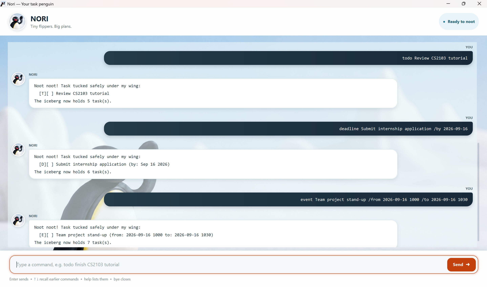

# Nori User Guide

Nori is a desktop task companion for keeping to-dos, deadlines, and events in
one calm, searchable list. Type a command in the field at the bottom and press
Enter or select **Send**. Nori saves changes beside the application, so your
tasks are there the next time you open it.



## Getting started

Start by adding a few tasks, then use `list` to see them:

```
todo review the CS2103 tutorial
deadline submit reflection /by 2026-09-18
event project stand-up /from 2026-09-16 1000 /to 2026-09-16 1030
list
```

All commands are lowercase. Use dates in `yyyy-MM-dd` form, for example
`2026-09-18`. Type `help` at any time for the built-in command reminder.

## Add tasks

`todo <description>` adds a task without a date.

Example: `todo review lecture notes`

`deadline <description> /by <date>` adds a task due on one date.

Example: `deadline submit reflection /by 2026-09-18`

`event <description> /from <start> /to <end>` adds an event. Its start and end
can be dates, times, or both. Add a date and time to `/from` when you want the
event to appear in time order in a schedule.

Example: `event project stand-up /from 2026-09-16 1000 /to 2026-09-16 1030`

Nori understands common times such as `0900`, `9:30`, `2pm`, and `2:30 PM`.

## View and find tasks

`list` shows every task. `list /from <date> /to <date>` shows dated tasks in an
inclusive date range.

Examples:

```
list
list /from 2026-09-15 /to 2026-09-21
```

`on <date>` finds the deadlines and events that fall on that date.

Example: `on 2026-09-16`

`find <keyword>` searches task descriptions without regard to letter case.

Example: `find project`

`schedule [date]` lays out one day: timed events come first, followed by all-day
events, deadlines, and to-dos. Omit the date to see today.

Examples:

```
schedule
schedule 2026-09-16
```

## Update tasks

Use the number shown by `list`, `find`, `on`, or `schedule`.

| Command | What it does | Example |
| --- | --- | --- |
| `mark <number>` | Marks a task complete. | `mark 2` |
| `unmark <number>` | Marks a task incomplete. | `unmark 2` |
| `delete <number>` | Removes a task. | `delete 2` |

## Helpful keyboard shortcuts

After entering commands, press the up and down arrow keys in the command field
to recall them. Recalled commands are editable before you send them again. The
orange outline around the composer shows where keyboard input will go.

## Finish a session

`bye` closes Nori. Your saved tasks remain available when you launch it again.

## Command reference

| Command | Purpose |
| --- | --- |
| `todo <description>` | Add a to-do. |
| `deadline <description> /by <date>` | Add a deadline. |
| `event <description> /from <start> /to <end>` | Add an event. |
| `list [ /from <date> /to <date> ]` | List all tasks or dated tasks in a range. |
| `on <date>` | Show tasks falling on a date. |
| `schedule [date]` | Show one day's schedule. |
| `find <keyword>` | Search task descriptions. |
| `mark <number>` | Complete a task. |
| `unmark <number>` | Reopen a task. |
| `delete <number>` | Delete a task. |
| `help` | Show the in-app command summary. |
| `bye` | Close Nori. |
